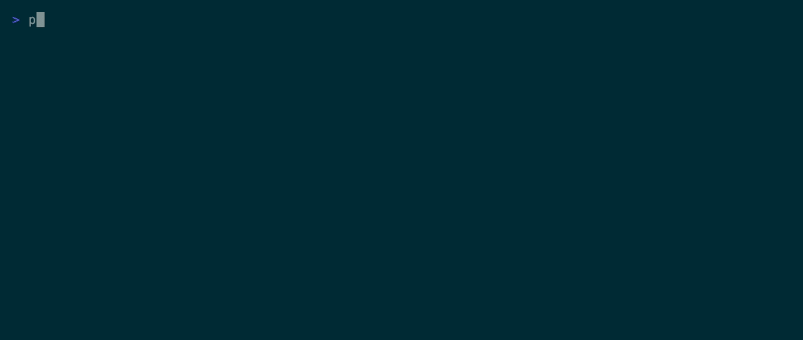

# sessions

A single-file Python TUI session picker — and cross-provider query CLI — for the
coding-agent CLIs:

- **Claude Code** (`claude`) — glyph **C**
- **GitHub Copilot CLI** (`copilot`) — glyph **P**
- **OpenAI Codex CLI** (`codex`) — glyph **X**
- **Google Gemini CLI** (`gemini`) — glyph **G**

Run it on any folder. It lists every session any provider has recorded for that folder —
newest first, with calendar timestamp, age, turn count, on-disk size, and the first user
message. Pick one with the arrow keys, hit Enter, and it resumes with the right CLI and the
right flags. The list auto-refreshes every 1.5 seconds.



## Install

Stdlib-only. No `pip`, no Homebrew, no Node.

```
git clone https://github.com/esaruoho/sessions ~/work/sessions
chmod +x ~/work/sessions/sessions.py
ln -s ~/work/sessions/sessions.py ~/.local/bin/sessions
```

Requires Python 3.11+ (uses `datetime.fromisoformat` with `Z` handling). The picker is pure
stdlib; two *optional* commands need more (see [Beyond the picker](#beyond-the-picker)).

## Usage

```
sessions                     # picker for the current directory
sessions ~/work/paketti      # picker for that folder
```

Keys:

| key | action |
|---|---|
| `↑` / `↓` (or `k` / `j`) | move selection |
| `g` / `G` | jump to top / bottom |
| `Enter` | resume the selected session |
| `n` | new **Claude** session in this folder |
| `c` | new **Copilot** session |
| `x` | new **Codex** session |
| `m` | new **Gemini** session |
| `q` / `Esc` | quit |

Resume invocations:

- Claude → `claude --dangerously-skip-permissions --resume <uuid>`
- Copilot → `copilot --resume=<uuid>`
- Codex → `codex resume <uuid>`
- Gemini → `gemini --resume <uuid>`

## What each row looks like

```
 C  today 14:32   7m    36t   393K  [apple skill boot] boot up apple skill…   44a489
 G  today 09:11   3h    45t      ·  [pricing table] Check Paketti pricing     e9ee0f
 X  04-20 09:18   1mo    2t   356K  study this folder and tell me why…        019da9
```

Columns: provider glyph · calendar timestamp · relative age · message turns · on-disk size ·
`[custom title]` (if you renamed the session) + first user message · short uuid (dim).

## Beyond the picker

`sessions` doubles as a plain-text, pipe-friendly query CLI across **all** providers at once —
handy from scripts or from inside another agent (`!sessions cat <id>`):

```
sessions ls [N]              # plain-text listing across all providers (default 50)
sessions cat <id>            # print a full transcript (any provider) to stdout
sessions grep <pattern>      # search session contents across all providers
sessions open <id>           # resume a session in its native tool (non-interactive)
```

IDs match any uuid or prefix — a 6-char prefix is plenty.

### Memory promotion (ENVOY chain)

Three more commands turn a sprawl of transcripts into addressable knowledge —
`raw transcript → distilled digest → promoted note`:

```
sessions distill <id> [--force]           # ~250-word digest, cached at
                                          #   ~/.sessions/distilled/<provider>/<uuid>.md
sessions promote <id> [--topic T] [--force]  # distill, then file the digest into a vault
sessions sgrep <phrase> [--raw] [--top N] [--threshold X]   # semantic search
```

- **`distill`** shells out to the **`claude`** CLI to write the digest (the one command that
  needs a coding-agent installed).
- **`promote`** copies the digest into `~/work/cc/vault/sources/conversations/<topic>/` — the
  "cc-vault" of durable notes.
- **`sgrep`** ranks distilled digests by meaning using **Apple's on-device NaturalLanguage
  embeddings** (macOS, no network, no key); `--raw` searches full transcripts of the newest 30.
  Symlink `sessions.py` as `sgrep` to drop the subcommand prefix.

## How it finds your sessions

| provider | store | match on folder |
|---|---|---|
| Claude | `~/.claude/projects/<encoded-cwd>/<uuid>.jsonl` | `realpath(folder)`, then every non-alphanumeric char → `-`, matching Claude's own encoding (works for iCloud-symlinked projects) |
| Copilot | `~/.copilot/session-store.db` | SQL `WHERE cwd = realpath(folder)` |
| Codex | `~/.codex/sessions/YYYY/MM/DD/rollout-*.jsonl` | parse the `session_meta` line, match `cwd`, skip subagent rollouts |
| Gemini | `~/.gemini/tmp/<project>/chats/session-*.jsonl` | read `.project_root`, match `realpath(folder)`, skip subagent sessions |

## Demo

The banner is a **recorded-terminal GIF** — an animated capture of the picker so a visitor
sees what it does in two seconds. It's generated deterministically (not by screen-capturing a
real session — the sessions in it are **synthetic fixtures**, so no real prompts or paths are
ever recorded) with [charmbracelet/vhs](https://github.com/charmbracelet/vhs):

```bash
brew install vhs
vhs demo.tape        # → demo.gif  (run from the repo root)
```

`demo/make-fixture.py` builds a throwaway `$HOME` with a handful of fake sessions across all
four providers; `demo.tape` points the picker at it. Edit either to change what the GIF shows.

## Why a single file

If a tool needs more than one file you have to install it. This one you read, copy, symlink —
done. The picker is stdlib (curses, sqlite3, json, os, time) so there's nothing to vendor and
nothing to break when Python or the agent CLIs update. (The `demo/` fixture is only for
generating the README GIF; the tool is still just `sessions.py`.)

## Origin

Extracted from the [esaruoho/apple](https://github.com/esaruoho/apple) skill collection, where
it lives at `bin/sessions` alongside 65+ other Apple-native CLI tools and a `/sessions [folder]`
slash command for Claude Code. That repo is the source of truth for personal Apple-native
automation; this repo carries `sessions` on its own so anyone juggling more than one
coding-agent CLI can use it without cloning the whole apple skill.

When the apple repo's copy diverges, **this** one is the version to follow.

## License

MIT.
